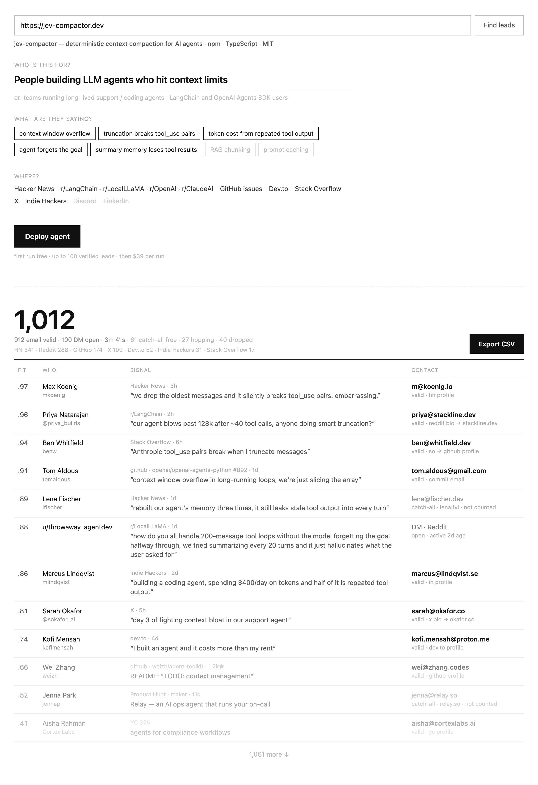
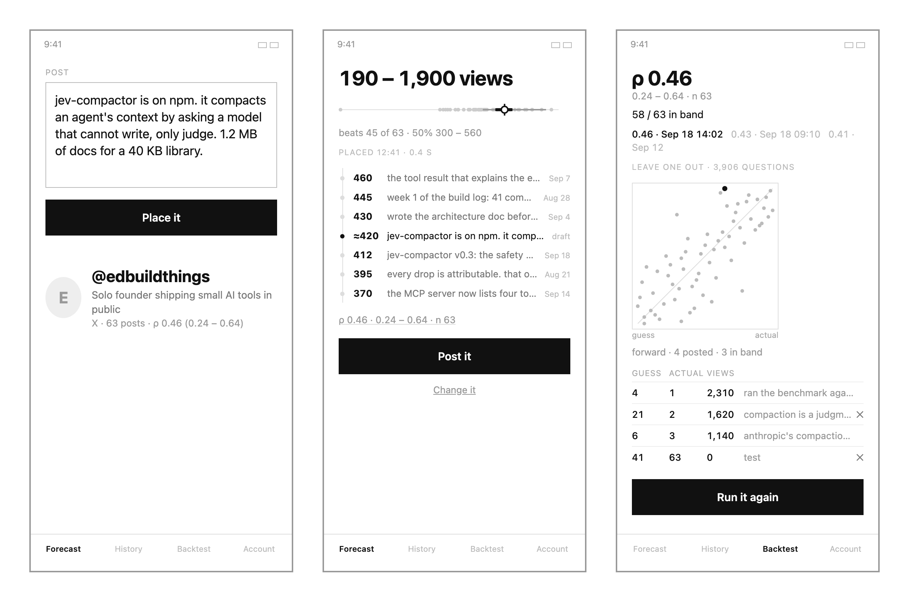

# mockspeed

A Claude skill that renders fast, disposable greyscale mockups while an idea is still being talked through — so the screen in your head becomes something you and other people can look at, within one turn, cheap enough to throw away.

The point is thinking speed, not fidelity. A mockspeed render is a napkin sketch: not a design, not a prototype, not the beginning of a build. The skill is one file, [`SKILL.md`](SKILL.md). Two tools sit next to it: a [renderer](#spec-and-renderer) that draws a mock from a short JSON spec in milliseconds, and a [lint](#lint) that judges the result against the rules.

## Examples

Two mocks from real sessions. Each is one screen's worth of HTML with no external assets, plus the running spec that is the thing that actually carries forward.

### leadgen

**The app:** paste a product's URL and get a large list of reachable people — email or DM — who are publicly complaining about the problem the product solves.

**The mock:** one page in two states stacked top to bottom — the Confirm step (inferred audience, pain phrases as chips, sources) above the Results table, with the reachable count as the hero and the contact column carrying the most weight.

[](examples/leadgen/mock.html)

[`mock.html`](examples/leadgen/mock.html) · [`spec.json`](examples/leadgen/spec.json) · [`spec.md`](examples/leadgen/spec.md)

### Forecast

**The app:** before posting, a draft is placed against the account's own past posts by pairwise judgments from a model that only judges (Jev), and the screen shows the 90% band of views it is likely to get — with a backtest that says whether the method works on this account at all.

**The mock:** three phone frames — Draft, Result, Backtest — where the band is the headline, the draft's neighbours are real past posts, and the backtest shows the model's misses as rows rather than describing them.

[](examples/forecast/mock.html)

[`mock.html`](examples/forecast/mock.html) · [`spec.json`](examples/forecast/spec.json) · [`spec.md`](examples/forecast/spec.md)

**Provenance.** The leadgen HTML is the file rendered during its session. Forecast's design session produced a judged running spec but never rendered the sketch to a file, so the mock here was rendered from that spec, under the skill's rules, for this repo. Both `spec.md` files are trimmed to the mockspeed format; product decisions that belong to the build (pricing, vendors, pipeline) are left out. The `spec.json` next to each is the same mock re-expressed for the [renderer](#spec-and-renderer), written after the fact; rendered, each gets the same lint verdict as the hand-written HTML. Most mockspeed renders never become files at all — in chat they are drawn inline and replaced by the next turn's render, which is the intended lifecycle.

## Principles

The skill is short; these are its load-bearing rules.

1. **Fake data before layout.** Write the real content first — seven actual habit names with actual streak counts, four actual invoice rows with amounts and dates, at least one edge case (empty, overdue, zero, very long). Never placeholders, never lorem ipsum, never grey bars standing in for words. A layout built around real specifics is forced to organise actual things; one built around placeholders drifts into arranging sections.

2. **Starve the text.** Twenty words maximum of non-data text per screen — labels, buttons and nav count, data does not. No explanatory paragraph anywhere, no hero subtitle, no helper text, no empty-state pep talk, no section headers unless the screen does two unrelated jobs. Explanatory text is the clearest tell of a machine-made mockup: it is added on top of a layout that already had room, and pushes the useful things out. If a screen needs explaining, the layout is wrong.

3. **Greyscale, but use the whole range.** Greyscale keeps the mock honestly disposable — nobody defends it. But shades are hierarchy: near-black for the one thing that matters most on the screen, mid grey for supporting content, faint grey for chrome and metadata. That is depth, not style; a second person can see where the eye should land without any colour or type decision having been made. No colour, no brand, no icons beyond simple shapes, no shadows, no rounded-corner fussing.

4. **One current mockup.** Each new detail earns a new render, which replaces the previous one. No gallery. A render that lands after the conversation has moved on is simply ignored — never "does this still match?"

5. **Quarantine the code.** The spec carries forward; the code never does. When the idea graduates to a build, the mock HTML is not read, not imported, not cleaned up. Reaching for it drags every slop decision into the real thing. What survives is the running spec — screens, primary action per screen, elements in hierarchy order, data shape, decisions — and that is what gets handed to the builder.

Two rules about *when*: fire the moment concrete elements are named (a header, a list, a card, a tab bar), and not before — a purely conceptual idea (a market, an audience) should stay verbal, because a rendered screen anchors thinking prematurely. And stay static; go clickable only for a question that cannot be answered without clicking ("is three steps too many?"), because working software invites defending instead of discarding.

## How to use

### Install

**Claude Code** — clone into your user-level skills folder so it is available in every project:

```bash
git clone https://github.com/edwardyen724-g/mockspeed.git ~/.claude/skills/mockspeed
```

Or copy `SKILL.md` into `<repo>/.claude/skills/mockspeed/SKILL.md` to scope it to one project.

**Claude.ai, the Claude desktop app, Cowork** — add the `mockspeed` folder (just `SKILL.md`) as a custom skill.

### Then just talk

You do not invoke it. Describe the thing you are imagining; the moment you name concrete screen elements — "a list of habits with a streak count on each row and a big button at the bottom" — the skill fires and a greyscale render appears at the end of the turn, after the prose. Saying *mock*, *mockup*, *wireframe*, *what would this look like* or *picture a screen where…* also triggers it.

Each turn:

- Claude names the screen's **primary action** to itself, writes the fake data, lays out around it, renders, and keeps talking. The render is not the response; at most one line says what decision it is testing.
- Add a detail, get a new render. Rule something out, it disappears.
- Ask a question that needs clicking, and only then does it go interactive (in-memory state, same greyscale, same word budget, only the paths the question needs).

When the idea is ready to build, ask for the **running spec** and hand that to the build — never the HTML. It looks like the two `spec.md` files above.

### Where the render shows up

In chat, it draws inline with the visualiser. In Claude Code and other agentic surfaces it writes a spec and runs the [renderer](#spec-and-renderer), which produces a single self-contained HTML file in the session's scratch directory; open it in a browser, or ask for a screenshot. Without the renderer it writes the HTML itself. Native apps get a plain phone frame with a faked status bar and tab bar; plugins get a faint fake host painted around the panel so scale reads correctly. Both come with the honest caveat that a rendered rectangle cannot judge feel or integration — only screen count, order and what lives where.

## Spec and renderer

A mock written as HTML costs a hundred-odd lines of generation per render, and most of those lines are layout and CSS decisions that Rule 5 says must never carry forward. [`render/render.mjs`](render/render.mjs) takes those decisions away: the mock is a short JSON **spec** — screens, each with its primary action and its elements in screen order — and the renderer draws it, in milliseconds, with no dependencies. What the author writes is the fake data and the hierarchy; what the author cannot write is a layout.

```bash
node render/render.mjs examples/forecast/spec.json -o mock.html
```

```json
{ "title": "habits", "frame": "phone", "screens": [
  { "name": "Today", "primary": "tick off today's habits", "elements": [
    { "kind": "list", "tier": "heavy", "rows": [
      { "n": "41", "text": "Write 200 words", "meta": "today", "on": true },
      { "n": "12", "text": "Run", "meta": "yesterday" },
      { "n": "0",  "text": "Call mum", "meta": "—", "off": true } ] },
    { "kind": "button", "label": "Add habit" },
    { "kind": "tabs", "items": ["Today", "Streaks", "Settings"], "on": "Today" } ] } ] }
```

The vocabulary is small and closed — `stat`, `text`, `field`, `button`, `chips`, `tabs`, `list`, `table`, `row`, `strip`, `scatter` — and each element has a `tier`: `heavy` for the one thing that matters on the screen, `mid` for supporting content, `faint` for chrome and metadata. That is Rule 3 made mechanical. Frames are `web`, `phone` (status bar, tab bar at the bottom) and `panel` (a plugin panel in a faint host); screens sit in a `row` or a `stack`. The full format, one line per kind, is the header of `render.mjs`. There is no heading kind, no colour, no icon, no free positioning; a caption above an element is allowed and gets judged like anything else the designer wrote.

Three things fall out of the spec being the source:

- **The lint marks are structural.** Rows, values and items declared `data` are marked as data by the renderer, so mocklint reads the output with nothing hand-placed, asks fewer questions, and the author cannot forget a mark. Anything the designer typed that is not data — a label, a button, a caption, a `text` line without `data: true` — is judged.
- **Every element has an id.** `data-id="list1"` on each element and `data-screen` on each screen are what the next step — pointing at a node and saying what to change — will address.
- **The spec is the running spec.** `data` and `decisions` are carried in the file and never rendered; `primary` sits on each screen. Rule 5's handoff document and the render input are the same JSON.

A bad spec is refused with every offender named (`screens[0].elements[2]: unknown kind 'hero' (stat | text | …)`), which is the feedback an author needs when it is writing the file blind.

## Lint

Rules 1 and 2 are lint-shaped — a word budget, no placeholders, no explanatory text, no section headers, at least one edge case — but the skill enforces them by having the author check its own work in the same breath as writing, which is why `SKILL.md` has to shout ("hard constraints, because vague instructions do not survive contact with generation"). [`lint/mocklint.mjs`](lint/mocklint.mjs) moves those checks out of the author's head into a judge that can't be talked out of them.

It splits the work the way a judge-only model demands. **Jev** ([TypeSafe](https://docs.typesafe.ai)) gets one Choice per text node — *what role does this play on the screen: data, label, button, nav, heading, explanation, placeholder?* — and one Noul, *is this an edge value?* Roles are defined by who wrote the text (a user, the system, or the designer), not by how it reads, because Jev reads criteria literally and a post that *sounds* like an explanation is still data. **Code** does what Jev cannot: counts the words of non-data nodes against the budget, checks "at least one edge case", and decides. Nothing is fixed; offenders are named by node.

```bash
cd lint && npm install
export TYPESAFE_API_KEY=…            # or put it in ./.env.local; it is never printed
node mocklint.mjs ../examples/forecast/mock.html
node mocklint.mjs ../examples/leadgen/mock.html --split hr.sep
node mocklint.mjs mock.html --nodes   # dry run: show what would be judged, no Jev call
```

Output on the Forecast mock (three screens, ~150 questions, ~1.3 s, well under a cent):

```
Backtest — PASS · 11 / 20 non-data words (12 if the ambiguous lines count)
  non-data:
    [51] "guess"           1w  label   P(data) 0.01
    [56] "views"           1w  label   P(data) 0.01
    [73] "Run it again"    3w  button  P(data) 0.01
    [74] "Forecast"        1w  nav     P(data) 0.00
    …
  ambiguous — decide yourself:
    [52] "actual"          1w  label   P(data) 0.42
  edge cases:
    [71] "0"                           P 0.92
```

Three things the render can tell the lint, because the renderer knows them and a reader often can't:

- `data-screen="Backtest"` on a container names a screen (the budget is per screen). `--screens <selector>` or `--split <selector>` work for mocks without it.
- `data-lint="data"` on an element declares it and its children as data — a value, a post, something the system produced. Marked nodes are counted as data and not judged. This matters for screens that show generated content: on leadgen's Confirm step the inferred audience and pain phrases are the product's output, but to a reader they look like designer copy, and unmarked they fail the budget at 83 words. Marked, the verdict is the strict reading of Rule 2: the fine print (`first run free · up to 100 verified leads · then $39 per run`, 10 words, explanation 0.80) and the `or: …` alternates line are the violations, and `Who is this for?` is a section heading. The leadgen mock predates the lint and is kept as rendered, so it fails as shipped; its `spec.json`, rendered, reaches the same verdict with the marks placed by the renderer.
- `data-lint="ignore"` leaves an element out (a fake host frame around a plugin panel, say).

What to expect from the numbers: P(data) below 0.4 counts against the budget, above 0.6 is data, between is listed as *ambiguous* for you to decide, and the budget is reported both ways. Jev's answers drift by up to ~0.1 between identical runs, so a mixed line like `58 / 63 in band` will sometimes cross that band and a screen sitting exactly on 20 will sometimes read 24. That's the model, not the mock; the band is there so it shows up as a question rather than a flip. The edge-case check is a warning, not a failure — Jev judges each value alone and "far longer than its neighbours" needs a comparison it can't make.

## Layout

```
SKILL.md                 the skill, verbatim
render/                  render.mjs — spec → greyscale HTML, no dependencies
lint/                    mocklint.mjs · package.json — the Jev-backed rule checker
examples/
  leadgen/               spec.json · mock.html · mock.png · spec.md
  forecast/              spec.json · mock.html · mock.png · spec.md
```

## License

MIT — see [`LICENSE`](LICENSE).
